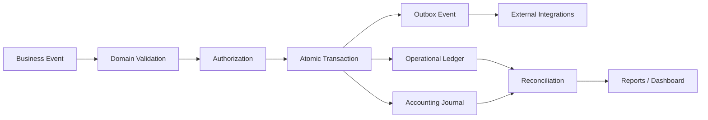
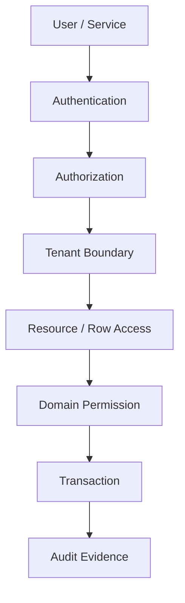
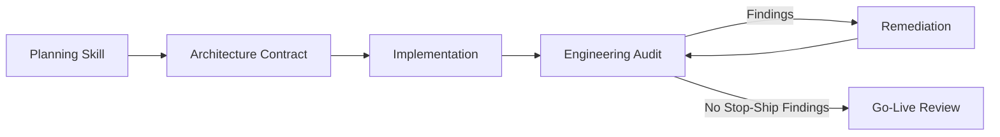

<div align="center">

# ⚙️ Hazim's ERP Engineering Skills

### Build ERP systems that remain correct after the demo ends.

**Two AI engineering skills for planning and auditing ERP systems with production-grade discipline.**

[](https://github.com/hazim5-stack)


```text
┌──────────────────────────────────────────────────────────────┐
│              HAZIM'S ERP ENGINEERING SKILLS                 │
├─────────────────────────────┬────────────────────────────────┤
│  01 · PLAN                  │  02 · AUDIT                    │
│  Design before coding       │  Attack assumptions            │
│  Define invariants          │  Demand runtime evidence       │
│  Model business events      │  Find silent failures          │
│  Specify acceptance tests   │  Decide production readiness   │
└─────────────────────────────┴────────────────────────────────┘
```

</div>

---

## 🔥 Why I Built This

I am **Hazim Batwa**. I built this project after watching a public debate around an AI-built ERP system turn into one of the clearest software-engineering lessons of the AI era.

A non-career software engineer demonstrated an ERP-style system built rapidly with AI. The interface looked complete: purchasing, inventory, quality, finance, HR, production, sales, roles, dashboards, and a modern stack. The discussion that followed, however, moved away from screens and into the questions that actually determine whether an ERP tells the truth.

What happens when two users reserve the same stock at the same instant? When goods arrive before the supplier invoice? When the UI offers FIFO but the costing engine silently uses moving average? When inventory posts but accounting fails? When someone backdates a transaction into a closed period? When a timeout retries the same operation? When the system has been running for months and the dashboard must reconcile with the ledger?

That discussion made the core problem obvious to me:

> **AI can generate a large amount of software very quickly. It does not automatically know which business invariants are non-negotiable.**

The danger in ERP is not an ugly screen. The danger is a beautiful screen backed by a system that can silently lie about money, stock, cost, ownership, permissions, or historical state.

So I created these skills to give AI a stricter engineering contract.

The first skill forces the model to **plan the system before coding it**. The second forces it to **audit an existing implementation adversarially and prove claims with evidence**. Together they are intended to prevent the class of failures that look harmless in a demo and become expensive after real users, real money, real inventory, concurrency, integrations, and time enter the system.

This repository is not an argument against AI-assisted development. It is the opposite. I want AI to build faster — but inside engineering boundaries that make speed useful rather than dangerous.

**— Hazim Batwa**

---

## 🧠 The Core Principle

```text
UI ≠ ERP
CRUD ≠ ERP
Number of tables ≠ ERP
Number of tests ≠ ERP
Installed security libraries ≠ secure ERP
A successful demo ≠ production readiness

ERP = BUSINESS INVARIANTS THAT REMAIN TRUE UNDER FAILURE, LOAD, TIME, AND HUMAN ERROR
```

Every important rule should be expressible as some combination of:

```text
Business Rule
   ↓
Domain Invariant
   ↓
Database Constraint / Transaction Boundary
   ↓
Authorization Rule
   ↓
Acceptance Test
   ↓
Failure / Concurrency Test
   ↓
Reconciliation Evidence
```

---

# 📦 Skills

## 01 — Hazim Batwa's ERP Project Planning Skill

**Path:** [`skills/erp-project-planning/SKILL.md`](skills/erp-project-planning/SKILL.md)

Use this skill **before implementation**.

It forces the AI to plan the ERP from business events, ledgers, state machines, permissions, accounting rules, inventory behavior, manufacturing flows, transaction boundaries, failure modes, reconciliation rules, tests, deployment, and recovery — instead of starting from pages and CRUD endpoints.

### It covers

- domain discovery and bounded contexts
- business events and invariants
- accounting kernel and double-entry journals
- GRNI and inventory ledger design
- FIFO / moving average / FEFO
- reservations and units of measure
- purchasing, sales, receivables and payables
- manufacturing, BOM, routing and WIP
- quality gates and lot/serial traceability
- RBAC, RLS and segregation of duties
- transactions, concurrency and idempotency
- outbox and asynchronous side effects
- APIs, reporting and reconciliation
- observability, backup, PITR and restore
- migration, cutover and acceptance testing
- production-readiness gates

### Final planner decision

```text
READY FOR IMPLEMENTATION
or
NOT READY FOR IMPLEMENTATION
```

---

## 02 — Hazim Batwa's ERP Engineering Audit Skill

**Path:** [`skills/erp-engineering-audit/SKILL.md`](skills/erp-engineering-audit/SKILL.md)

Use this skill when a codebase already exists.

It treats claims as unproven until the repository, database, tests, runtime behavior, deployment configuration, or recovery evidence proves them.

### Finding states

```text
PASS
FAIL
PARTIAL
NOT TESTED
NOT APPLICABLE
```

### Severity model

| Severity | Meaning |
|---|---|
| 🔥 Critical | Can corrupt financial/operational truth, expose tenants, destroy recoverability, or make the system unsafe for production |
| 🔴 High | Serious security, consistency, authorization, availability, or accounting failure |
| 🟠 Medium | Material engineering weakness that can become a production incident |
| 🟡 Low | Local weakness, maintainability problem, or hardening opportunity |
| 🔵 Info | Observation, evidence, or improvement note |

> **Any unresolved Critical finding can block production readiness regardless of the total score.**

---

# 🏗️ Engineering Surface

The skills are intentionally **technology-aware but not vendor-locked**.

| Layer | Recommended / Common Technologies |
|---|---|
| Frontend | TypeScript, React, Next.js, Vue, Angular |
| Backend | TypeScript/Node.js/NestJS, Java/Spring Boot, C#/.NET, Python/FastAPI/Django, Go |
| Primary database | PostgreSQL preferred for relational ERP workloads; MySQL/MariaDB/SQL Server also possible |
| Cache | Redis |
| Object storage | S3-compatible storage / MinIO |
| Messaging | Kafka, RabbitMQ, NATS, SQS-style queues |
| API | REST/JSON, OpenAPI, GraphQL where justified, gRPC for internal contracts |
| Auth | OIDC, OAuth 2.0, secure sessions, short-lived JWT where appropriate |
| Transport | HTTPS/TLS 1.2+; TLS 1.3 preferred |
| Containers | Docker / OCI |
| Orchestration | Kubernetes when justified; simpler managed/container platforms otherwise |
| Reverse proxy | Caddy, NGINX, Envoy, managed gateways |
| Observability | OpenTelemetry, Prometheus, Grafana, structured logs, distributed tracing |
| CI/CD | GitHub Actions, GitLab CI, equivalent controlled pipelines |
| IaC | Terraform / OpenTofu / Pulumi |
| Security | OWASP ASVS concepts, SAST, DAST, secret scanning, dependency scanning, SBOM |
| Testing | unit, integration, E2E, property-based, concurrency, load, failure injection, restore drills |

Full technical reference: [`docs/TECHNICAL_REFERENCE.md`](docs/TECHNICAL_REFERENCE.md)

---

# 🔌 Protocols & Contracts

```text
HTTPS / TLS
REST + JSON
OpenAPI 3.x
OAuth 2.0 / OpenID Connect
Webhooks + signed payloads
Idempotency-Key semantics
Transactional Outbox
Optimistic / pessimistic concurrency controls
Database transactions
Row-Level Security where applicable
JSON Schema / runtime validation
Object-storage signed URLs
AMQP / Kafka-style event transport where needed
OpenTelemetry Protocol (OTLP)
SMTP / provider APIs for notification side effects
S3-compatible object APIs
```

A protocol appearing in the stack does **not** make the implementation correct. The audit asks whether retries, authorization, replay, ordering, failure, timeout, duplicate delivery, and reconciliation behavior are defined.

---

# 🧱 ERP Truth Model



The dashboard is intentionally last.

---

# 💰 Accounting Invariants

```text
Σ Debit = Σ Credit

Inventory quantity cannot be created or destroyed without a traceable business event.

Operational inventory value must reconcile to the accounting inventory balance under the selected costing policy.

A posted transaction is reversed, not silently deleted.

A closed accounting period is protected by server/database rules, not just hidden UI controls.

Historical exchange rates belong to transactions; today's rate must not rewrite yesterday's books.
```

---

# 📦 Inventory Invariants

```text
ON_HAND = sum(valid stock movements)
AVAILABLE = ON_HAND - RESERVED - QUALITY_HOLD - other controlled allocations

FIFO shown in UI ⇒ real FIFO cost layers exist.
FEFO is an operational picking policy, not automatically an accounting valuation method.
UOM conversion must be applied consistently inside the transactional model.
Reservations and issues must remain correct under concurrency.
```

---

# 🏭 Manufacturing Invariants

```text
BOM ≠ list of labels
WIP ≠ text field
Quality Hold ≠ visual badge
Traceability ≠ search box
Partial completion ≠ full completion divided by percentage
```

The skills require explicit handling of BOM versions, effectivity, component issues, returns, scrap, rework, partial completion, WIP, indirect costs, routing/work centers where applicable, lots/serials, quality states, and forward/backward traceability.

---

# 🔐 Security Model



The project rejects the idea that "we use JWT" or "we have RLS" is enough evidence. The implementation must prove the complete access path.

---

# ⚡ Failure Is Part of the Design

The skills deliberately test scenarios such as:

```text
DB dies during a transaction
network timeout after commit
client retries the same command
worker receives the same message twice
two users reserve the last unit simultaneously
object upload succeeds but DB commit fails
DB commit succeeds but external webhook fails
report executes over a large historical period
period closes while another user is posting
integration returns late or out of order
backup exists but restore fails
```

A system that works only when everything else works is not production-ready.

---

# 🧪 Evidence, Not Confidence

The audit does not accept:

```text
"The code looks safe."
"The README says RLS is enabled."
"There are 1,000 tests."
"We use PostgreSQL transactions."
"The framework handles that."
"AI reviewed it."
```

It asks for evidence such as:

```text
file + line
schema constraint
migration
transaction boundary
negative authorization test
concurrency test
load-test result
reconciliation query
restore drill
runtime trace
CI configuration
signed artifact / provenance
```

If evidence cannot be established, the correct result is **NOT TESTED**, not an invented PASS.

---

# 🤖 AI / Vibe-Coding Guardrails

The skills specifically look for common AI-generated software failure patterns:

- happy-path-only implementations
- UI options with no matching backend semantics
- silent fallbacks
- fake feature completeness
- duplicated validation rules that drift
- money stored as floating point
- soft-delete on immutable ledger movements
- authorization enforced only in frontend code
- unbounded retries
- retry without idempotency
- Redis treated as source of financial truth
- auto-generated schemas without domain invariants
- tests generated from implementation rather than business contracts
- impressive counts used as substitutes for evidence
- architecture terminology unsupported by actual boundaries

---

# 🚦 Suggested Workflow



### For a new ERP

```text
1. Give the AI the business requirements.
2. Load the Planning Skill.
3. Do not allow implementation until the planning gate passes.
4. Build against the resulting contracts and acceptance tests.
5. Load the Audit Skill against the finished codebase.
6. Fix findings.
7. Re-audit.
8. Perform UAT and production-readiness review.
```

### For an existing ERP

```text
1. Load the Audit Skill.
2. Give the AI repository + DB/schema + deployment/test access where possible.
3. Require evidence for every PASS.
4. Treat Critical findings as stop-ship.
5. Repair root causes, not screenshots or symptoms.
6. Re-run the audit.
```

---

# 📁 Repository Structure

```text
Hazim-s-ERP-Skills-/
│
├── README.md
├── SECURITY.md
├── CONTRIBUTING.md
│
├── skills/
│   ├── erp-project-planning/
│   │   └── SKILL.md
│   └── erp-engineering-audit/
│       └── SKILL.md
│
└── docs/
    ├── CASE_STUDY.md
    └── TECHNICAL_REFERENCE.md
```

---

# 🎯 What This Repository Is — and Is Not

### It is

- an engineering planning framework
- an adversarial ERP review framework
- a set of AI operating instructions
- a production-readiness checklist
- a domain-correctness checklist
- a way to make AI demand evidence instead of trusting its own confidence

### It is not

- a complete ERP product
- a replacement for accountants, warehouse experts, manufacturing experts, security specialists, or UAT
- a guarantee that every ERP domain fits every company
- a claim that one technology stack is universally correct
- permission to deploy financial software without qualified review

---

# 🧭 The Lesson Behind the Project

The most useful conclusion from the 2026 ERP debate was not "AI cannot build ERP" and it was not "programmers are obsolete."

It was this:

> **Writing code is no longer the scarce part. Knowing what must remain true is.**

For ERP, the engineering job is to identify the invariants that must survive concurrency, retries, permissions, integrations, accounting periods, migrations, failures, and months of real operational use — and then force those invariants into the database, transaction model, authorization model, tests, reconciliation, and recovery process.

That is what these skills are designed to teach an AI agent to do.

---

<div align="center">

## Built by Hazim Batwa

**Engineering constraints for AI-assisted ERP development.**

`PLAN → PROVE → BUILD → ATTACK → RECONCILE → RECOVER`

</div>
